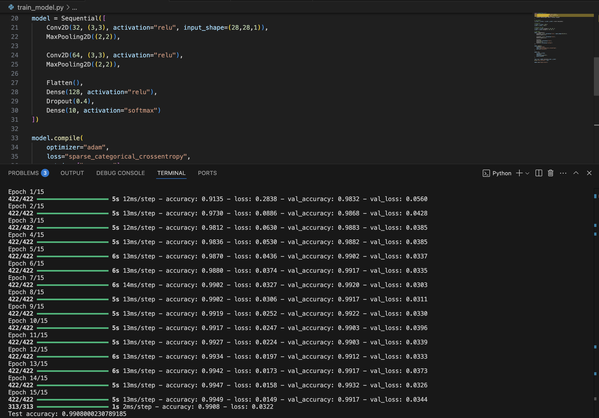
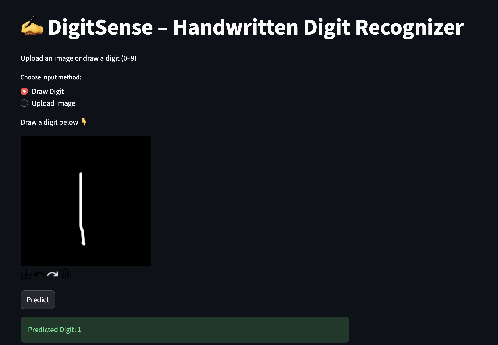
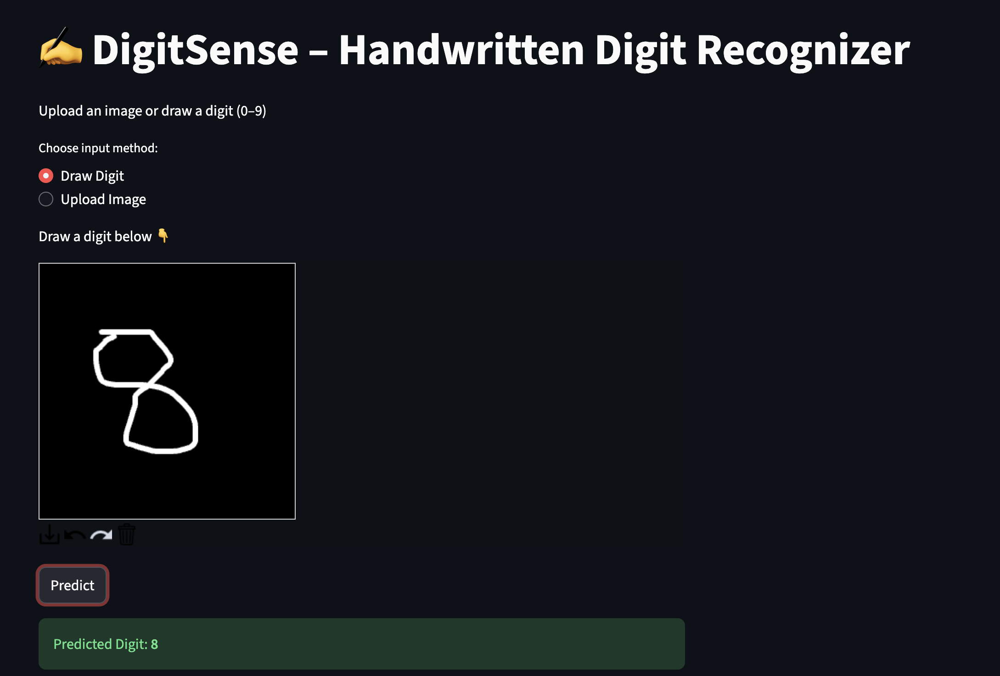
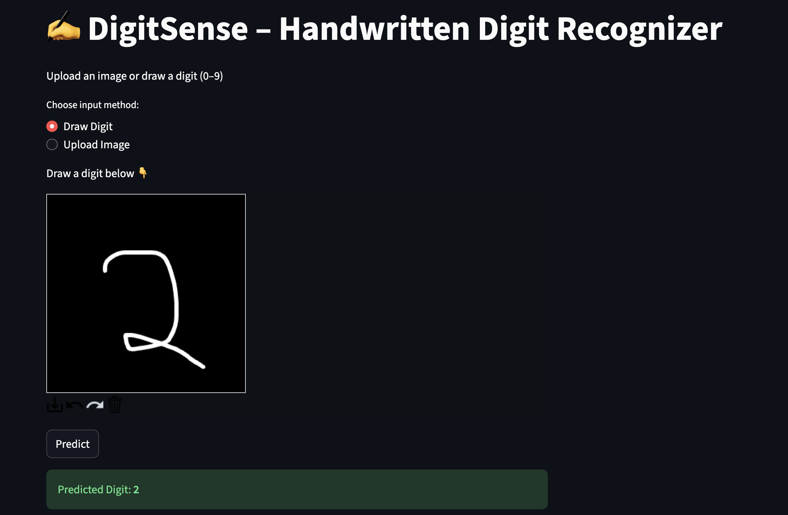

# ✍️ DigitSense – Handwritten Digit Recognizer

DigitSense is a real-time handwritten digit recognition system built using Convolutional Neural Networks (CNNs) and deployed as an interactive Streamlit web application.  
It supports both freehand digit drawing and image upload, delivering accurate predictions using a CNN trained on the MNIST dataset.

---

## 🚀 Features

- Draw digits using mouse/trackpad (default mode)
- Upload handwritten digit images
- CNN-based digit classification
- ~99.3% accuracy on MNIST test set
- Real-time prediction with confidence score
- Interactive Streamlit UI

---

## 🧠 Model Performance

- Training Accuracy: ~99.5%
- Validation Accuracy: ~99.3%
- Test Accuracy: **99.31%**

### Test Accuracy Screenshot

---

## 🖼️ App Screenshots

| Canvas Input | Prediction |
|-------------|------------|
|  |  |
|  |  |

---

## 🛠️ Tech Stack

- Python 3.10
- TensorFlow / Keras
- Convolutional Neural Networks (CNNs)
- Streamlit
- streamlit-drawable-canvas
- NumPy
- Pillow

---

## 📂 Project Structure

DigitSense/
├── app.py
├── train_model.py
├── digits.keras
├── requirements.txt
├── screenshots/
│ ├── prediction1.png
│ ├── prediction2.png
│ ├── prediction3.png
│ ├── prediction4.png
│ └── accuracy.png
└── README.md

---

## ▶️ Run Locally

conda create -n mnist-app python=3.10
conda activate mnist-app
pip install -r requirements.txt
streamlit run app.py

---

## 👤 Author

Dhananjay Badoni  
GitHub: https://github.com/Dhananjay0719

⭐ Star the repository if you find it useful!
